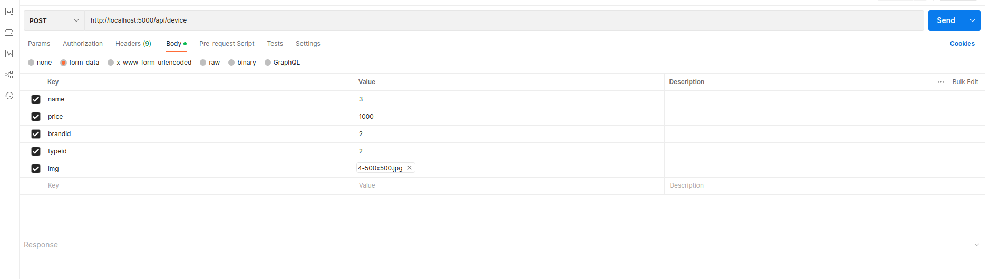
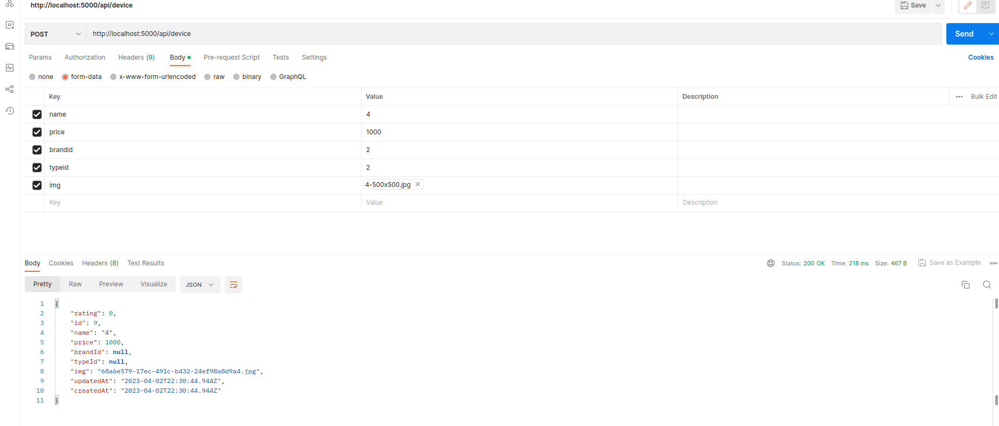

npm run dev - запуска сервера
postgresql - используемая база данных
pgAdmin4 - графический интерфейс,
всякие версии для node, прописанны в файлике package.json
Postman - на этой платформе проверяй работу способность проект, на нём создаю объекты.
 вот собственно проверка, если у меня нажать send будет такое
 на brandid и typeid выдаёт null, а должно 2.
